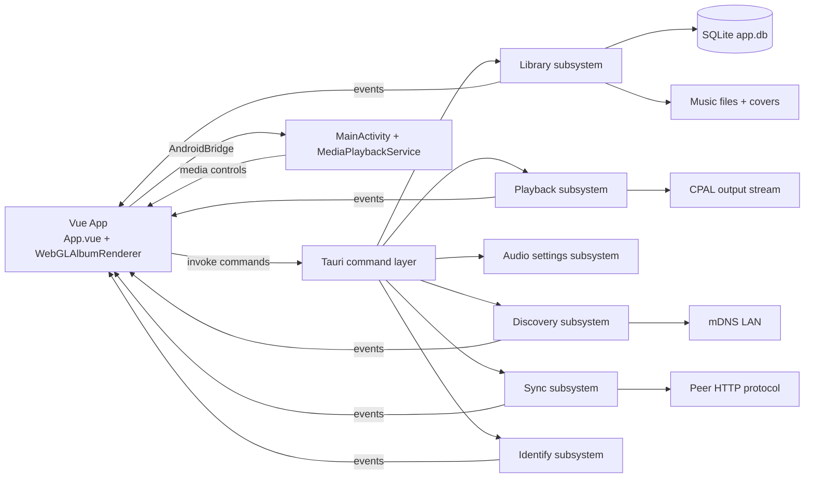
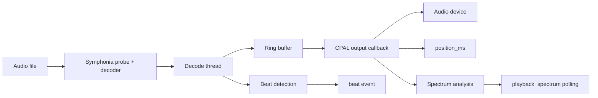

# Project Design

This document describes the current design of the project as it exists in the repository today. It is intentionally descriptive rather than aspirational: it captures the actual architecture, runtime boundaries, state ownership, and known tradeoffs.

## 1. Purpose

Player is a local-first music player built with Vue 3 on the frontend and Rust on the backend through Tauri 2. The application is designed to:

- Index and manage a local music library.
- Play audio files with native output and low-latency controls.
- Store and edit metadata, covers, likes, history, and playlists.
- Support smart playlists defined by filter rules.
- Discover peer devices on the same LAN and sync music and metadata.
- Run on desktop and Android with a native Android media notification.
- Provide a richer now-playing experience, including beat-reactive visuals and a WebGL album renderer.

The project is not designed as a cloud service, a streaming client, or a multi-user system.

## 2. Technology Stack

- Frontend: Vue 3 + TypeScript + Vite.
- Shell/runtime: Tauri 2.
- Backend: Rust.
- Audio decode: Symphonia.
- Audio output: CPAL.
- Local database: SQLite via rusqlite.
- File watching: notify.
- Metadata extraction: lofty.
- LAN discovery: mdns-sd.
- Peer sync transport: tiny_http server + reqwest blocking client.
- Audio identification: rusty-chromaprint + AcoustID.
- Rich now-playing visual: Three.js in a dedicated Vue component.

## 3. Repository Structure

The project is split into a small number of high-value surfaces:

- [src/App.vue](src/App.vue): the main application shell and almost all frontend behavior.
- [src/components/WebGLAlbumRenderer.vue](src/components/WebGLAlbumRenderer.vue): isolated WebGL renderer for the now-playing card.
- [src-tauri/src/lib.rs](src-tauri/src/lib.rs): Tauri bootstrap, managed state registration, and command exposure.
- [src-tauri/src/library.rs](src-tauri/src/library.rs): local library, indexing, persistence, playlists, history, and covers.
- [src-tauri/src/playback.rs](src-tauri/src/playback.rs): audio playback engine, seek, beat detection, spectrum generation.
- [src-tauri/src/audio.rs](src-tauri/src/audio.rs): output device enumeration and auxiliary audio settings state.
- [src-tauri/src/discovery.rs](src-tauri/src/discovery.rs): mDNS peer discovery.
- [src-tauri/src/sync.rs](src-tauri/src/sync.rs): peer HTTP server, file transfer, and metadata merge.
- [src-tauri/src/identify.rs](src-tauri/src/identify.rs): audio fingerprinting and AcoustID lookup.
- [src-tauri/gen/android/app/src/main/java/dev/verncat/player/MainActivity.kt](src-tauri/gen/android/app/src/main/java/dev/verncat/player/MainActivity.kt): Android WebView bridge and OS integration.
- [src-tauri/gen/android/app/src/main/java/dev/verncat/player/MediaPlaybackService.kt](src-tauri/gen/android/app/src/main/java/dev/verncat/player/MediaPlaybackService.kt): Android media notification and media session service.

## 4. High-Level Architecture

The system is intentionally split across three runtime layers:

- The Vue frontend owns screen state, queue logic, and interaction flow.
- The Rust backend owns local persistence, audio IO, indexing, sync, discovery, and native events.
- The Android layer owns OS-facing playback controls and notification/session behavior.

An important design choice is that queue semantics live in the frontend, not the backend. Rust playback is track-centric; Vue decides what "next", "previous", "repeat", and "up next" mean.

## 5. Frontend Design

### 5.1 Main UI shell

The frontend is centered around [src/App.vue](src/App.vue). This file acts as:

- The top-level application shell.
- The navigation controller.
- The playback coordinator.
- The queue owner.
- The modal/menu controller.
- The event listener hub for Tauri events.
- The responsive/mobile layout host.

This is a deliberately pragmatic but monolithic design: most state is colocated with the UI that consumes it, at the cost of a very large single-file component.

### 5.2 Navigation model

`activeNav` in [src/App.vue](src/App.vue) selects the major screen. Current views are:

- `home`: recent tracks and a curated/demo "Made For You" section.
- `library`: full library grouped by artist.
- `search`: currently a placeholder view.
- `history`: play history.
- `playlists`: regular playlists and smart playlists.
- `discovery`: peer devices and sync controls.

On mobile, navigation is presented as a side drawer opened by a burger button instead of a permanently visible desktop sidebar.

### 5.3 UI sections and behavior

The main UI currently supports:

- Recent tracks on the home screen.
- Library browsing grouped by artist.
- Inline playback badges for current track and next track.
- Regular playlists backed by SQLite.
- Smart playlists defined by rules and evaluated against the loaded library snapshot.
- Play history view.
- Discovery and sync dashboard.
- Device settings modal for sync identity.
- Track edit modal, identify workflow, playlist menus, and long-press mobile context menus.
- A persistent footer player and a larger detail/now-playing card.

The "Made For You" section is currently static demo content defined in [src/App.vue](src/App.vue), not a backend-driven recommendation system.

### 5.4 State ownership

Frontend state is stored in Vue refs and computed values rather than a dedicated store library. The main state groups are:

- Playback presentation state: `isPlaying`, `currentTime`, `duration`, `volume`.
- Queue state: `queueSource`, `queueSourceIndex`, `queue`, `nowPlaying`, `queuePlaylistTracks`.
- Library state: `libraryTracks`, `recentTracks`, `historyEntries`, `covers`.
- Playlist state: `playlists`, `playlistView`, smart playlist editing/view state.
- Discovery/sync state: `peers`, `syncEnabled`, `syncProgress`, device identity state.
- Visual state: detail card transforms, beat animation, spectrum levels.
- Modal/menu state: settings, device menu, queue menu, add-to-playlist menu, track context menu.

The design favors directness over abstraction. Most actions are plain functions inside [src/App.vue](src/App.vue) that call Tauri commands and then update refs.

### 5.5 Queue and transport control design

Queue behavior is frontend-owned:

- `playTrackFrom(...)` chooses a source list and starts playback of a single file.
- `playNext()` and `playPrev()` are implemented in Vue using local queue state.
- `refillQueue()` computes up to five upcoming items.
- Repeat and shuffle modes are UI-level concerns.
- Track list badges such as "now playing" and "up next" are derived from Vue state.

This means the backend does not maintain playlist playback state. The backend only knows about the currently loaded file and its playback position.

### 5.6 Event integration

The frontend listens to native/backend events emitted by Rust:

- `beat`: drives beat-reactive animation.
- `discovery-peers`: updates visible LAN peers.
- `sync-progress`: updates per-peer sync progress.
- `index-progress`: shows local indexing progress.
- `identify-progress`: shows track identification progress.
- `library-changed`: reload trigger after indexing, identification, or sync.
- `playback-finished`: fallback path for end-of-track handling.

On Android there is also a direct JS bridge surface:

- `window._playbackFinished()`: invoked directly from Rust/Android to avoid background event timing issues.
- `window._mediaControl(action)`: invoked by Android media notification buttons.

### 5.7 Visual design

The current visual system combines music metadata with generated decoration:

- Cover art is shown when available.
- When no cover is available, the UI derives gradients from the track hash.
- Tracks have rarity metadata that controls tinting and some animation.
- The now-playing detail view combines a WebGL-rendered album object with a CSS-driven spectrum ring.
- Beat events animate player controls and art using a decaying pulse model.
- Mobile typography, footer sizing, drawer navigation, and long-press menus were added to keep the same UI viable on phones.

### 5.8 WebGL now-playing component

[src/components/WebGLAlbumRenderer.vue](src/components/WebGLAlbumRenderer.vue) isolates the 3D portion of the now-playing detail card. It receives:

- `coverUrl`
- two palette colors
- rarity color
- beat scale
- play/pause state
- pointer tilt and offset
- dragging state

Responsibilities of this component:

- Build and own the Three.js renderer, scene, camera, geometry, and materials.
- Load real cover textures or generate gradient textures as fallback.
- Render a rounded album/card object with sheen/highlight effects.
- React to playback state, beat scale, and pointer motion without exposing Three.js details to the rest of the app.

This keeps the rendering code separate while the rest of the visual chrome remains in [src/App.vue](src/App.vue).

## 6. Backend Design

### 6.1 Tauri bootstrap

[src-tauri/src/lib.rs](src-tauri/src/lib.rs) does four things:

- Creates the Tauri application.
- Registers managed state objects.
- Auto-starts peer discovery during setup.
- Exposes the Rust command surface to the Vue frontend.

Managed state currently includes:

- `LibraryState`
- `AudioState`
- `PlaybackState`
- `DiscoveryState`
- `SyncState`

### 6.2 Command surface

The command layer is wide but straightforward.

Library commands:

- `search_tracks`
- `get_all_tracks`
- `reindex`
- `get_track_cover`
- `update_track`
- `toggle_like`
- `get_data_dir`
- `record_play`
- `get_recent_tracks`
- `get_play_history`
- `get_playlists`
- `create_playlist`
- `rename_playlist`
- `delete_playlist`
- `get_playlist_tracks`
- `add_track_to_playlist`
- `remove_track_from_playlist`
- `get_smart_playlists`
- `save_smart_playlist`
- `delete_smart_playlist`
- `get_device_emoji`
- `set_device_emoji`
- `get_device_settings`
- `set_device_settings`

Audio commands:

- `get_output_devices`
- `set_output_device`
- `get_volume`
- `set_volume`

Playback commands:

- `playback_play`
- `playback_pause`
- `playback_resume`
- `playback_stop`
- `playback_seek`
- `playback_set_volume`
- `playback_spectrum`
- `playback_status`

Discovery commands:

- `discovery_start`
- `discovery_stop`
- `discovery_peers`

Sync commands:

- `sync_set_enabled`
- `sync_get_enabled`
- `sync_with_peer`

Identify commands:

- `identify_tracks`

## 7. Library and Persistence Design

### 7.1 Data directory

The app is local-first and assumes a single writable library root.

- On Android, the data directory is `/sdcard/Player`.
- On non-Android targets, the data directory is `<app_data_dir>/data`.

Expected music layout is flexible, but the code assumes audio files live under this root and stores relative paths in the database.

### 7.2 Database

Persistence is centered around a single SQLite file: `app.db` under the data directory.

Main tables:

- `tracks`: core metadata, path, duration, cover blob, hash, rarity, manual edits, likes, play count, year, genre, date added.
- `play_history`: playback history tied to track IDs.
- `device_config`: local device emoji and user-visible device name.
- `playlists`: regular playlists.
- `playlist_tracks`: ordered membership of tracks in playlists.
- `smart_playlists`: saved smart playlist definitions.

Design notes:

- Schema migration is handled inline with additive `ALTER TABLE` statements, not with a separate migration framework.
- Covers are stored in SQLite as embedded image blobs extracted during indexing.
- Local track identity is the SQLite row ID.
- Cross-device identity is the file hash.

### 7.3 Metadata acquisition

Metadata is built with a priority chain:

1. Embedded audio tags.
2. Folder structure heuristics.
3. Filename parsing.

This keeps the library usable even when tags are missing or inconsistent.

### 7.4 Indexing model

The library subsystem in [src-tauri/src/library.rs](src-tauri/src/library.rs) is responsible for:

- Creating the data directory.
- Opening and initializing the database.
- Performing a full scan on first launch.
- Starting a filesystem watcher for incremental updates.
- Extracting metadata and covers from audio files.
- Hashing files for deduplication and sync.
- Emitting progress and library change events.

Important design decision:

- A full scan only happens automatically on first database creation.
- Later launches rely on the filesystem watcher plus user-triggered manual reindex.

This keeps startup cost lower after the initial import.

### 7.5 Playlists

There are two playlist systems:

- Regular playlists: stored in SQLite as explicit ordered track memberships.
- Smart playlists: stored in SQLite as saved rule sets, but evaluated in the frontend against the loaded library snapshot.

Smart playlist rules can currently target fields such as title, artist, album, genre, extension, year, play count, like state, and date added.

This is a hybrid design:

- Persistence lives in Rust/SQLite.
- Evaluation currently lives in Vue.

That makes iteration on UI rules easy, but it means smart playlist results are computed on the client side and depend on the currently loaded full library state.

## 8. Playback Design

### 8.1 Core model

[src-tauri/src/playback.rs](src-tauri/src/playback.rs) implements playback as a shared-state engine with:

- A decode thread.
- A ring buffer between decode and output.
- A CPAL output callback.
- Atomic playback state for play/pause/stop/position/duration/volume.
- Real-time beat and spectrum analysis.
- End-of-track notification back into the frontend.

### 8.2 Playback pipeline

### 8.3 State invariants

Important current invariants:

- Only one active playback stream is intended at a time.
- `play()` stops previous playback before starting new decode.
- `seek()` is implemented by stopping and restarting decode from the target position.
- `position_ms` represents audible progress, not decoder-head progress.
- Spectrum data is derived from frames actually consumed by the output callback.

That last invariant matters because buffered decode can run ahead of audible playback. The current implementation updates position from audio frames actually sent to the output stream, which keeps seeks and progress consistent.

### 8.4 Beat and spectrum design

The playback engine generates two visualization signals:

- Beat events: emitted from an energy-window detector in the decode pipeline.
- Spectrum: a 32-band FFT-based snapshot updated from output-consumed audio.

The frontend consumes them differently:

- Beat is event-driven.
- Spectrum is polled via `playback_spectrum` while the detail view is open.

This split reduces event chatter while still providing responsive motion.

### 8.5 Output device and volume design

There are two related but not fully unified backend surfaces:

- `AudioState` in [src-tauri/src/audio.rs](src-tauri/src/audio.rs) exposes device enumeration and a generic volume state.
- `PlaybackState` in [src-tauri/src/playback.rs](src-tauri/src/playback.rs) owns the actual playback stream volume and selected output device used by the stream.

Today, the UI uses `playback_set_volume` for real playback volume, but device selection flows through `AudioState`. This is a known architectural split and should eventually be unified so the device picker controls the same state the playback stream actually uses.

### 8.6 End-of-track behavior

When playback finishes naturally:

- Rust marks playback as finished.
- On Android, Rust tries to call `window._playbackFinished()` directly through the WebView.
- A Tauri `playback-finished` event is also emitted as fallback.
- The Vue app advances the queue and resynchronizes Android media state.

This direct callback exists because relying only on WebView-side Tauri event listeners was not reliable enough when Android background behavior was involved.

## 9. Discovery and Sync Design

### 9.1 Discovery

[src-tauri/src/discovery.rs](src-tauri/src/discovery.rs) implements peer discovery over mDNS/DNS-SD.

Each instance:

- Advertises itself as `_player._tcp.local.`.
- Browses for the same service type.
- Tracks peer host, addresses, port, device name, and emoji.
- Emits `discovery-peers` whenever the peer list changes.

Discovery is started automatically during app setup.

### 9.2 Sync protocol

[src-tauri/src/sync.rs](src-tauri/src/sync.rs) provides both server and client behavior.

When sync is enabled, the local app serves a small HTTP API on port `57322`:

- `GET /tracks`: index of available tracks with hashes and metadata.
- `GET /file/<hash>`: raw file content for a specific track hash.
- `GET /sync-data`: track metadata, playlists, smart playlists, and history.

Sync is hash-based:

- Files are identified by `file_hash`.
- Missing files are downloaded from peers.
- Hash collisions are treated as duplicates rather than separate items.
- Metadata and playlists are merged after transfer.

Frontend interaction model:

- The discovery view shows peers.
- Sync can be globally enabled or triggered per peer.
- Progress is streamed back through `sync-progress` events.

### 9.3 Device identity

Each device has two user-facing identity fields:

- `device_name`
- `emoji`

These are stored in `device_config`, exposed through sync endpoints, and shown in the discovery UI. This gives a friendly identity layer without a formal account system.

## 10. Track Identification Design

[src-tauri/src/identify.rs](src-tauri/src/identify.rs) provides metadata enrichment for existing local files.

Pipeline:

- Decode audio to PCM.
- Generate Chromaprint fingerprint.
- Query AcoustID.
- Write matched metadata back into the local library.
- Emit `identify-progress` to drive the frontend progress UI.

This subsystem is intentionally asynchronous and event-driven because identification can be slow and network-bound.

## 11. Android Design

### 11.1 Why Android needs a native layer

Tauri provides the embedded app shell, but Android playback UX still needs direct native integration for:

- Media notification controls.
- MediaSession playback state.
- Foreground service lifecycle.
- File-system permission handling.
- WebView-to-native bridging.

### 11.2 MainActivity bridge

[src-tauri/gen/android/app/src/main/java/dev/verncat/player/MainActivity.kt](src-tauri/gen/android/app/src/main/java/dev/verncat/player/MainActivity.kt) adds Android-specific behavior around the Tauri activity.

Key responsibilities:

- Store a weak reference to the WebView.
- Expose `AndroidBridge` JS methods to the frontend.
- Forward media session button actions back into JS.
- Request all-files access on Android when needed.
- Ensure `/sdcard/Player` exists.
- Acquire a Wi-Fi multicast lock so mDNS discovery works on Android.

Bridge methods exposed to JS:

- `updatePlayback(title, artist, isPlaying, positionSec, durationSec)`
- `stopPlayback()`
- `openFolder(relativePath)`

### 11.3 MediaPlaybackService

[src-tauri/gen/android/app/src/main/java/dev/verncat/player/MediaPlaybackService.kt](src-tauri/gen/android/app/src/main/java/dev/verncat/player/MediaPlaybackService.kt) owns Android's playback notification and media session.

Responsibilities:

- Maintain current title, artist, play/pause state, position, and duration.
- Publish a foreground media notification.
- Maintain a MediaSession with play/pause/next/previous/seek actions.
- Forward notification actions back into the WebView through `MainActivity.sendToJs(...)`.

### 11.4 Frontend/native contract

The Android notification is not driven directly by Rust playback state. Instead:

- Vue owns queue semantics and user-visible track identity.
- Vue calls `syncAndroid()` whenever the visible playback state changes.
- Native Android surfaces then mirror the frontend's notion of the current track.

This is an intentional consequence of frontend-owned queue behavior: the native layer mirrors the UI state rather than independently deriving playlist flow.

## 12. Events and Data Flow

### 12.1 Frontend to backend

Most frontend actions use direct Tauri `invoke(...)` calls. Typical flow:

1. User clicks a track.
2. Vue decides the source list and queue implications.
3. Vue invokes `playback_play` with a file path.
4. Vue starts polling `playback_status` and `playback_spectrum` as needed.
5. Vue pushes current state into Android via `syncAndroid()` when applicable.

### 12.2 Backend to frontend

Background or long-running subsystems communicate through events:

- Indexing and identify report progress.
- Discovery publishes peer snapshots.
- Sync publishes per-peer phase changes.
- Playback publishes beat pulses and completion notifications.
- Library writes emit `library-changed` so the frontend can reload derived state.

This gives the app a mixed model:

- Commands for request/response operations.
- Events for asynchronous, background, or streaming updates.

## 13. Build and Runtime Targets

Relevant package scripts in [package.json](package.json):

- `pnpm dev`: Vite-only frontend dev server.
- `pnpm build`: frontend typecheck and bundle.
- `pnpm tauri dev`: Tauri desktop/mobile dev.
- `pnpm android:build`: Android build.
- `pnpm android:sign`: signs the release APK.
- `pnpm android:deploy`: installs a previously built signed APK.
- `pnpm android:build-deploy`: full Android build followed by deploy.

The repository currently includes generated Android project files under `src-tauri/gen/android`. Those files are part of the build output surface for Android, but some of them also contain project-specific customizations and should be treated as part of the effective runtime design.

## 14. Known Tradeoffs and Constraints

The current design is functional and pragmatic, but several tradeoffs are explicit:

- [src/App.vue](src/App.vue) is a very large, stateful single-file component.
- Queue logic is in Vue, while playback execution is in Rust; this keeps UI control flexible but requires explicit synchronization.
- Smart playlist definitions are stored in SQLite, but rule evaluation is still frontend-side.
- The search view exists in the UI shell but is not implemented yet.
- The home screen includes hardcoded demo cards for "Made For You".
- Android media state depends on explicit frontend-to-native synchronization rather than a native-only playback source of truth.
- Output device state is currently split between `AudioState` and `PlaybackState`.
- Schema migration is additive and inline, not centrally versioned.
- Sync is optimized for trusted local networks and does not implement authentication, encryption, or conflict-heavy collaborative semantics.

These are not hidden bugs in the document; they are part of the current design reality.

## 15. Recommended Refactoring Directions

If the project grows, the highest-value refactors are:

- Split [src/App.vue](src/App.vue) into feature components and composables.
- Move smart playlist evaluation into Rust so results are queryable and consistent across screens and devices.
- Unify output device and volume ownership so the UI talks to a single playback settings surface.
- Introduce a clearer playback state machine shared by Rust, Vue, and Android sync code.
- Tighten the sync protocol with version negotiation, optional auth, and better conflict policy.
- Refresh [README.md](README.md) so repository-level documentation matches the real product instead of the default template.

## 16. Summary

The project is a local-first music player with a deliberately mixed architecture:

- Vue owns screen flow, queue behavior, and rich interaction.
- Rust owns persistence, IO, native audio, and background work.
- Android code owns OS playback integration.

The design favors shipping useful behavior quickly over deep abstraction. That shows up most clearly in the monolithic Vue shell, the frontend-owned queue, the event-heavy background flows, and the direct Android bridge. Despite those tradeoffs, the overall architecture is coherent: the app is built around a single local library, a single active playback engine, and optional LAN-based peer sync.