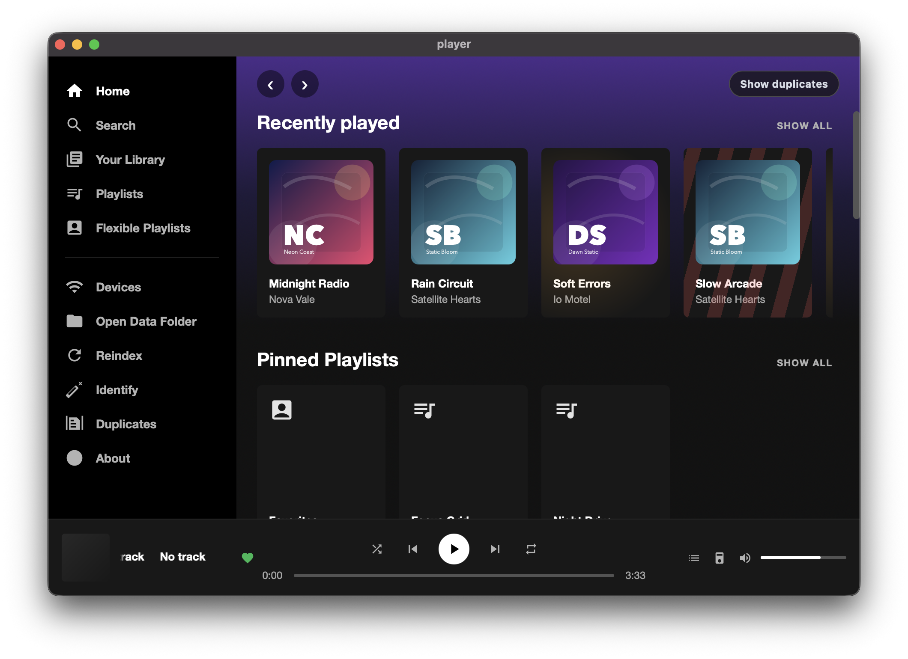
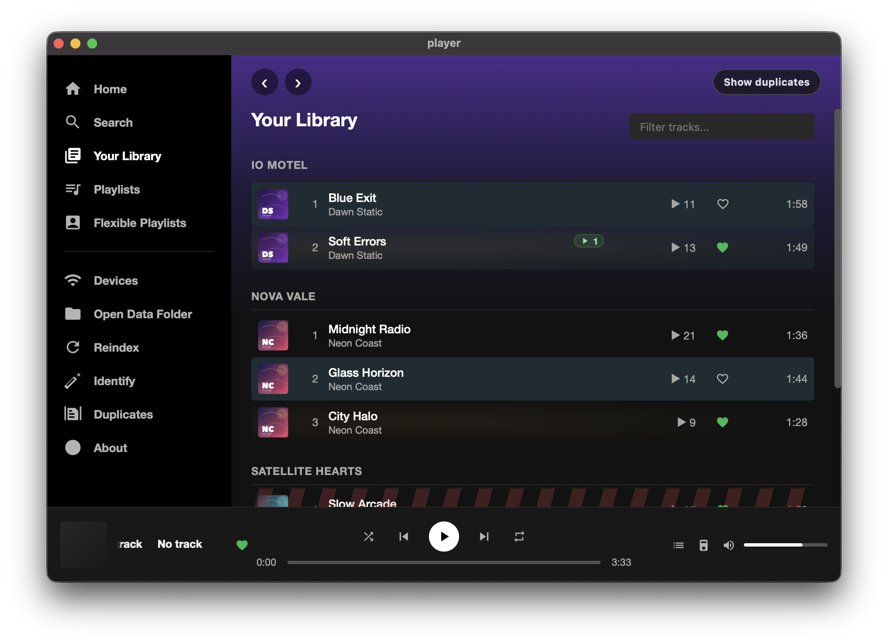
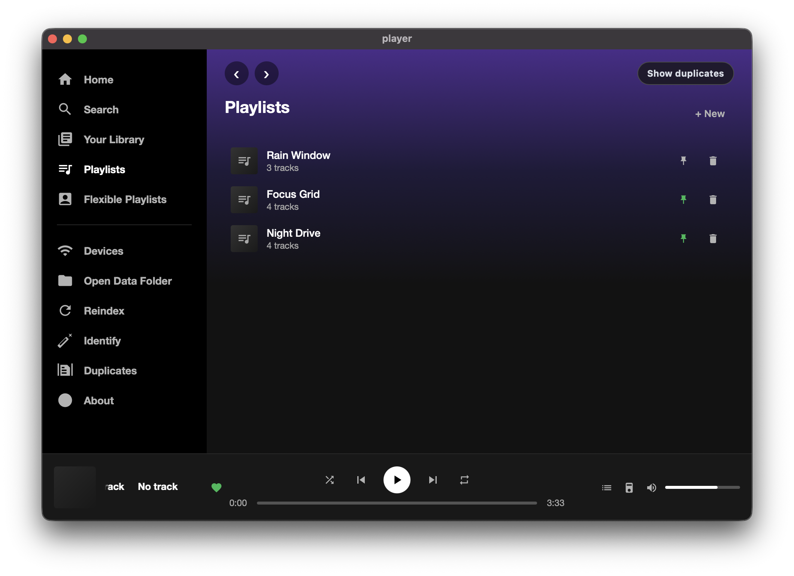
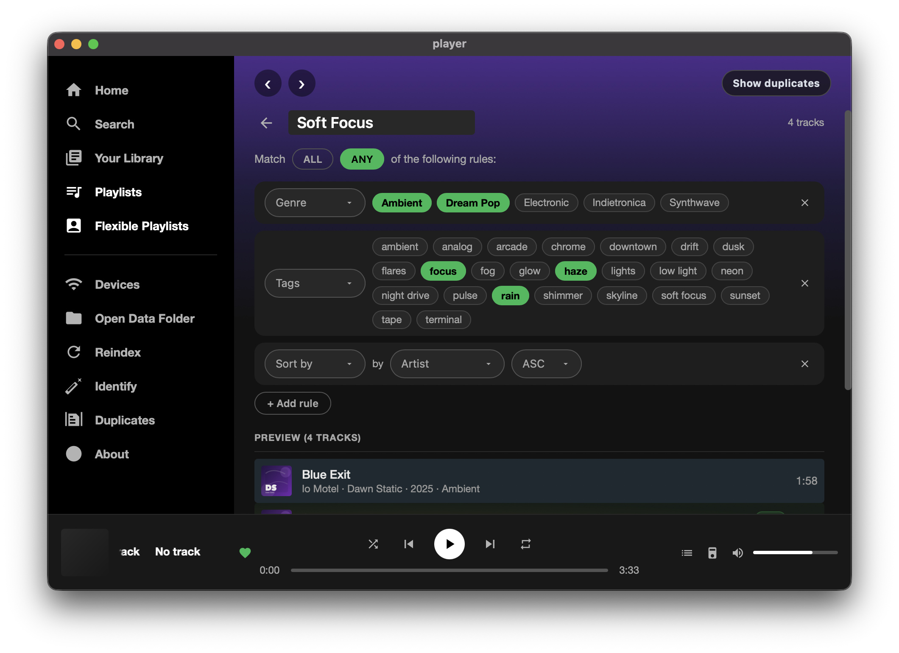
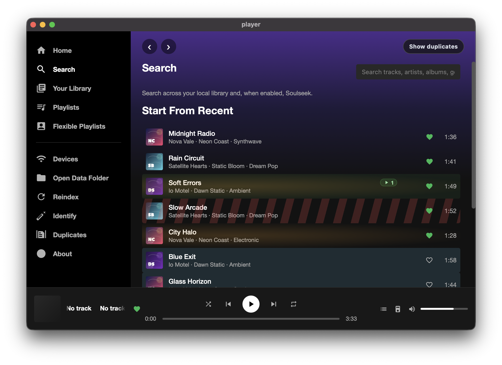
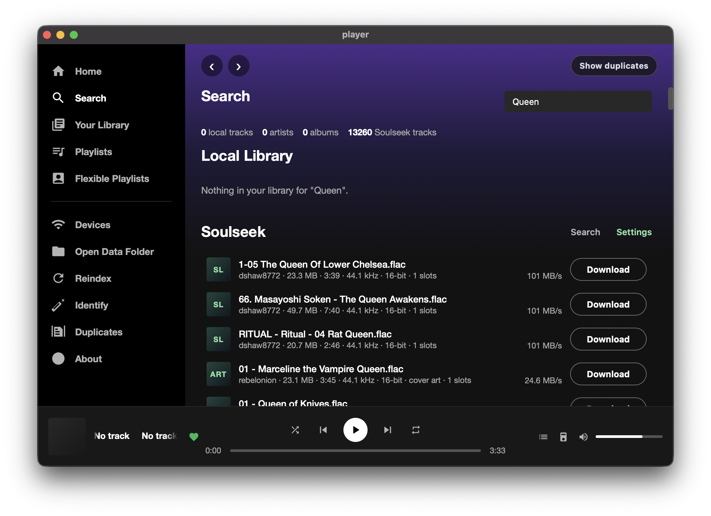
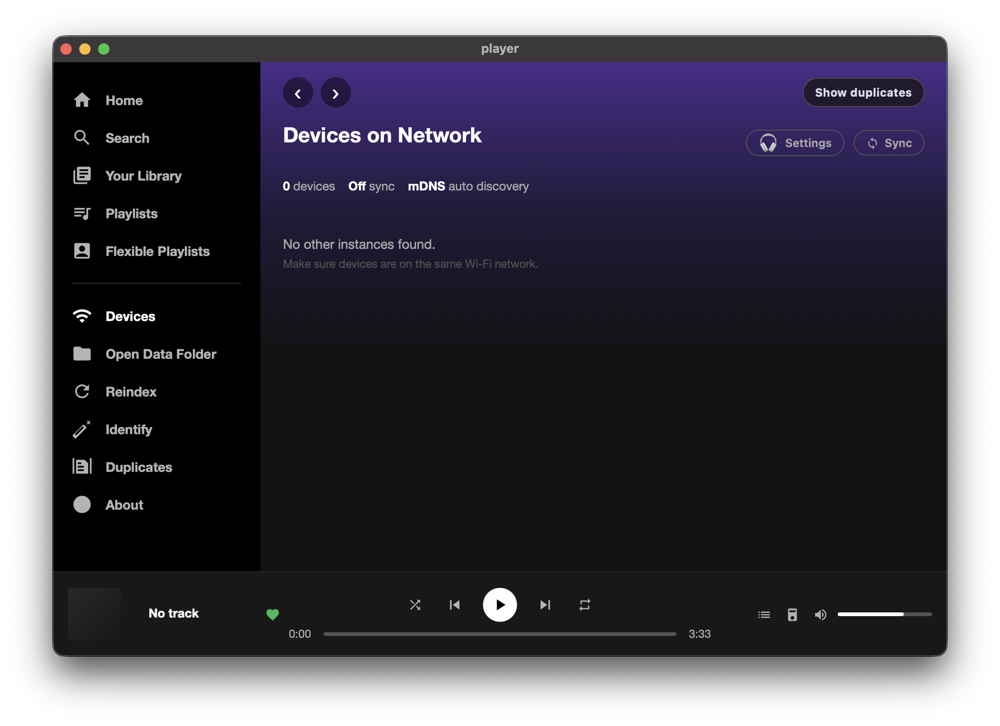

# Player

Player is a local-first music player built with Vue 3, TypeScript, Tauri 2, and Rust.

It is designed for people who keep a real music library on disk and want fast local playback, metadata editing, playlists, cross-device sync on a local network, and a native-feeling app on both desktop and Android.

This project is not a cloud streaming service. The filesystem is the source of truth, the app database is a fast local index, and sync is optimized for peer-to-peer usage inside your own network.

## Overview

Player currently focuses on six core jobs:

- Index a local music library and keep it in sync with the filesystem.
- Play audio files through a native Rust backend with low-latency controls.
- Store and edit metadata, likes, covers, history, and playlists.
- Build and evaluate smart playlists.
- Discover peer devices over LAN and sync files and metadata.
- Provide a richer now-playing experience with beat-reactive visuals and a WebGL album renderer.

## Screenshots

These screenshots were captured with the built-in demo mode. Click any image to open the full-size version.

<table>
	<tr>
		<td width="50%" align="center">
			<a href="./readme/first.png">
				
			</a>
			<br />
			<sub>Home with recently played and pinned playlists</sub>
		</td>
		<td width="50%" align="center">
			<a href="./readme/library.png">
				
			</a>
			<br />
			<sub>Library grouped by artist with rich track rows</sub>
		</td>
	</tr>
	<tr>
		<td width="50%" align="center">
			<a href="./readme/playlists.png">
				
			</a>
			<br />
			<sub>Regular playlists</sub>
		</td>
		<td width="50%" align="center">
			<a href="./readme/flexible-playlist-edit.png">
				
			</a>
			<br />
			<sub>Flexible playlist editor with rule-based filters</sub>
		</td>
	</tr>
	<tr>
		<td width="50%" align="center">
			<a href="./readme/search.png">
				
			</a>
			<br />
			<sub>Search starting state with recent listening context</sub>
		</td>
		<td width="50%" align="center">
			<a href="./readme/soulseek-search.png">
				
			</a>
			<br />
			<sub>Soulseek search results inside the app</sub>
		</td>
	</tr>
	<tr>
		<td colspan="2" align="center">
			<a href="./readme/devices.png">
				
			</a>
			<br />
			<sub>Devices and sync view</sub>
		</td>
	</tr>
</table>

## Current Features

### Library

- Recursive local library indexing.
- Metadata extraction from audio tags.
- Cover art support, including sidecar images.
- Track editing.
- Likes, play counts, history, and recent tracks.
- Duplicate detection and duplicate resolution tools.
- File hash tracking for safer indexing and stale-record cleanup.

### Playback

- Native audio decoding and playback in Rust.
- Seek, pause, resume, stop, and volume control.
- Output device selection.
- Playback spectrum data for visuals.
- Improved recovery around output stream changes and device switching.

### Organization

- Regular playlists.
- Smart playlists driven by filter rules.
- Track reveal/share actions from the UI.

### Sync and discovery

- Peer discovery over mDNS.
- Local network sync between devices.
- Merkle-style metadata reconciliation for efficient sync.
- History and playlist sync.
- IPv4/IPv6-friendly internal HTTP binding.

### Soulseek integration

- Search from Soulseek.
- Cover fetching.
- Download and preview flows.
- Track replacement workflow from search results.

### UI and platform work

- Responsive desktop/mobile layout.
- Android media integration.
- Rich now-playing surface with Three.js/WebGL rendering.
- About screen with version info, update checks, and embedded changelog.

## Tech Stack

- Frontend: Vue 3, TypeScript, Vite.
- Desktop/mobile shell: Tauri 2.
- Backend: Rust.
- Audio decode: Symphonia.
- Audio output: CPAL.
- Metadata extraction: lofty.
- Local database: SQLite via rusqlite.
- File watching: notify.
- LAN discovery: mdns-sd.
- Sync transport: tiny_http + reqwest.
- Audio identification: rusty-chromaprint.
- 3D visuals: Three.js.

## Architecture at a glance

The project is intentionally split across a few high-value runtime boundaries:

- Vue owns screen state, queue behavior, interaction flow, and visual presentation.
- Rust owns playback, indexing, persistence, sync, discovery, and native integration.
- Android-specific code owns OS-facing media session and notification behavior.

High-value source files:

- `src/App.vue`: main application shell and most frontend behavior.
- `src/components/WebGLAlbumRenderer.vue`: isolated Three.js renderer for the now-playing card.
- `src-tauri/src/lib.rs`: Tauri bootstrap and command registration.
- `src-tauri/src/library.rs`: library index, metadata persistence, playlists, history, covers.
- `src-tauri/src/playback.rs`: playback engine and spectrum generation.
- `src-tauri/src/discovery.rs`: peer discovery.
- `src-tauri/src/sync.rs`: sync protocol and peer HTTP server.
- `src-tauri/src/soulseek.rs`: Soulseek integration.

For a deeper architecture write-up, see [DESIGN.md](./DESIGN.md).

## Development

### Prerequisites

- Node.js 20+.
- pnpm.
- Rust toolchain.
- Tauri system dependencies for your platform.
- Android SDK/NDK if you want Android builds.

### Install

```bash
pnpm install
```

### Run in development

```bash
pnpm tauri dev
```

### Run in demo mode

```bash
pnpm tauri dev -- -- --demo
```

### Profile library indexing with Tracy

Run the optimized, instrumented desktop build, then connect the Tracy Profiler
UI to `127.0.0.1`:

```bash
pnpm tauri:tracy
```

The `tracy` Cargo feature is disabled by default. Its client accepts local
connections only and starts collecting on demand. Trigger **Reindex** in the app
to capture directory walking, database lock waits, metadata and cover reads,
file hashing, SQLite writes, CUE indexing, stale cleanup, and watcher batches.

### Build desktop app

```bash
pnpm tauri build
```

### Android

```bash
pnpm android:build
pnpm android:build-deploy
```

## Repository notes

- `soulseek-rs-repo/` contains an upstream/workbench copy of the Soulseek project.
- `src-tauri/vendor/soulseek-rs-lib/` contains the vendored library currently used by the app.
- `src-tauri/gen/android/` contains generated Android project files produced for the Tauri mobile target.

## Status

This project is actively evolving. The architecture is intentionally pragmatic: some surfaces are already well-isolated, while others are still consolidated to keep product iteration fast.

If you want the full descriptive architecture document, read [DESIGN.md](./DESIGN.md).
